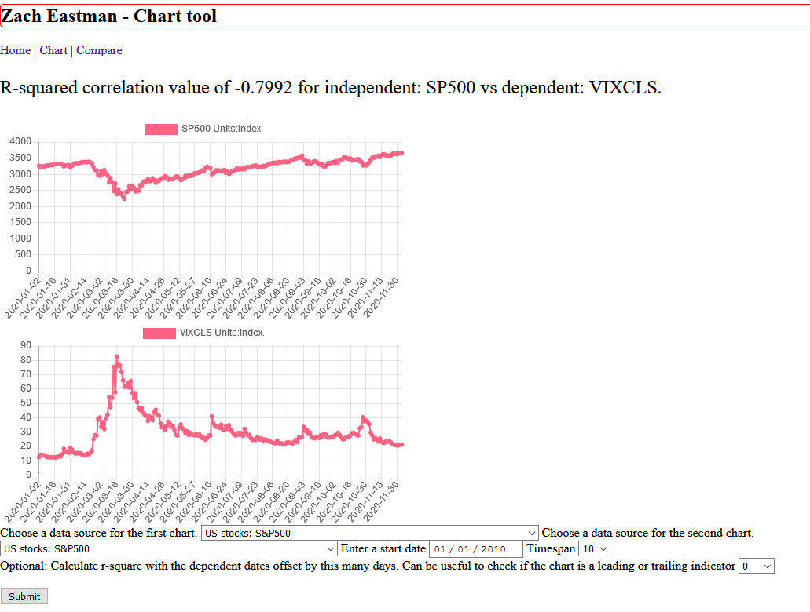

## Welcome to GitHub Pages

You can use the [editor on GitHub](https://github.com/eastmanz/eastmanz.github.io/edit/master/index.md) to maintain and preview the content for your website in Markdown files.

Whenever you commit to this repository, GitHub Pages will run [Jekyll](https://jekyllrb.com/) to rebuild the pages in your site, from the content in your Markdown files.

### Markdown

Markdown is a lightweight and easy-to-use syntax for styling your writing. It includes conventions for

```markdown
Syntax highlighted code block

# Header 1
## Header 2
### Header 3

- Bulleted
- List

1. Numbered
2. List

**Bold** and _Italic_ and `Code` text

[Link](url) and 
```



For more details see [GitHub Flavored Markdown](https://guides.github.com/features/mastering-markdown/).
## The final product, a fully functional web app usihg real-time data from the Federal Reserve's FRED
1. [The user facing server](https://github.com/eastmanz/eastmanz.github.io/blob/master/portfolio_final.py) and the [narrative](https://github.com/eastmanz/eastmanz.github.io/blob/master/narrative1.docx)
2. [The database handler, included by the server code](https://github.com/eastmanz/eastmanz.github.io/blob/master/portfolio_db.py) and the [narrative](https://github.com/eastmanz/eastmanz.github.io/blob/master/narrative3.docx)
3. [Additional functions, including algorithms to calc rsquare and download FRED data](https://github.com/eastmanz/eastmanz.github.io/blob/master/portfolio_util.py) and the [narrative](https://github.com/eastmanz/eastmanz.github.io/blob/master/narrative2.docx)

### Here I speak to the enhancements done (and it's a complete rewrite) to my web application.
[Youtube](https://youtu.be/Pl6ONOe5Wws)

### Original artifacts
The old files, functional, could be better.

1. [Standalone CRUD methods](https://github.com/eastmanz/eastmanz.github.io/blob/master/original_artifact/final_document_manipulation.py)
2. [Demonstrative MongoDB code, the new code uses SQL!](https://github.com/eastmanz/eastmanz.github.io/blob/master/original_artifact/final_document_retrieval.py)
3. [User client, includes the CRUD methods](https://github.com/eastmanz/eastmanz.github.io/blob/master/original_artifact/final_rest_server.py)
