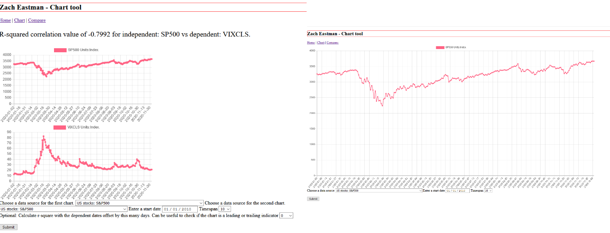

Hello! I'm Zach, and this is a web app. When I thought on what to pick for a rewrite out of all my code, the stock market web application stood out to me. Not only did data reflect the messy real world, but I already knew I could supplement and eventually replace the original source. The Federal Reserve makes freely available financial data series containing everything from GDP growth durin to the Great Depression, to what the NASDAQ was yesterday. It's an invaluable data source and this project wouldn't be the same without it.

### How the app looks

For more details see [GitHub Flavored Markdown](https://guides.github.com/features/mastering-markdown/).
## The final product, a fully functional web app usihg real-time data from the Federal Reserve's FRED
1. [The user facing server](https://github.com/eastmanz/eastmanz.github.io/blob/master/portfolio_final.py) and the [narrative](https://github.com/eastmanz/eastmanz.github.io/blob/master/narrative1.docx)
2. [The database handler, included by the server code](https://github.com/eastmanz/eastmanz.github.io/blob/master/portfolio_db.py) and the [narrative](https://github.com/eastmanz/eastmanz.github.io/blob/master/narrative3.docx)
3. [Additional functions, including algorithms to calc rsquare and download FRED data](https://github.com/eastmanz/eastmanz.github.io/blob/master/portfolio_util.py) and the [narrative](https://github.com/eastmanz/eastmanz.github.io/blob/master/narrative2.docx)

### Here I speak to the enhancements done (and it's a complete rewrite) to my web application.
[Youtube](https://youtu.be/Pl6ONOe5Wws)

### A reflection on what skills I've gained at SNHU
[Professional Self-Assessment](https://github.com/eastmanz/eastmanz.github.io/blob/master/Reflection.docx)

### Original artifacts
The old files, functional, could be better.

1. [Standalone CRUD methods](https://github.com/eastmanz/eastmanz.github.io/blob/master/original_artifact/final_document_manipulation.py)
2. [Demonstrative MongoDB code, the new code uses SQL!](https://github.com/eastmanz/eastmanz.github.io/blob/master/original_artifact/final_document_retrieval.py)
3. [User client, includes the CRUD methods](https://github.com/eastmanz/eastmanz.github.io/blob/master/original_artifact/final_rest_server.py)
